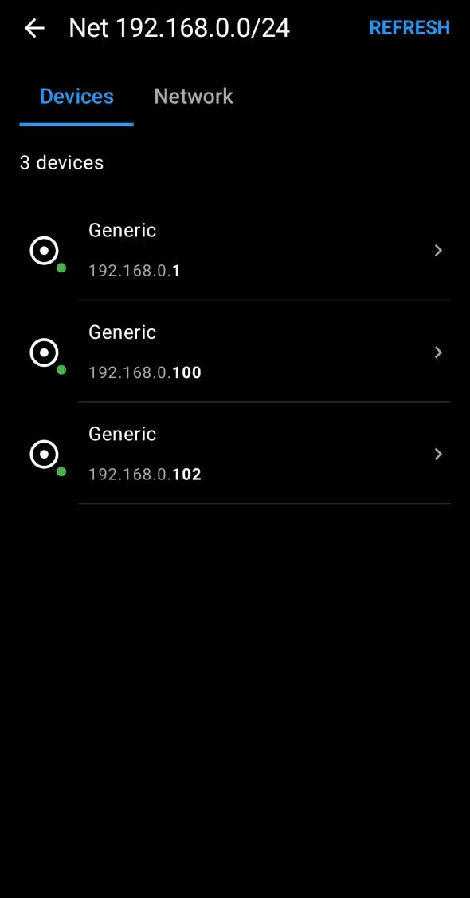
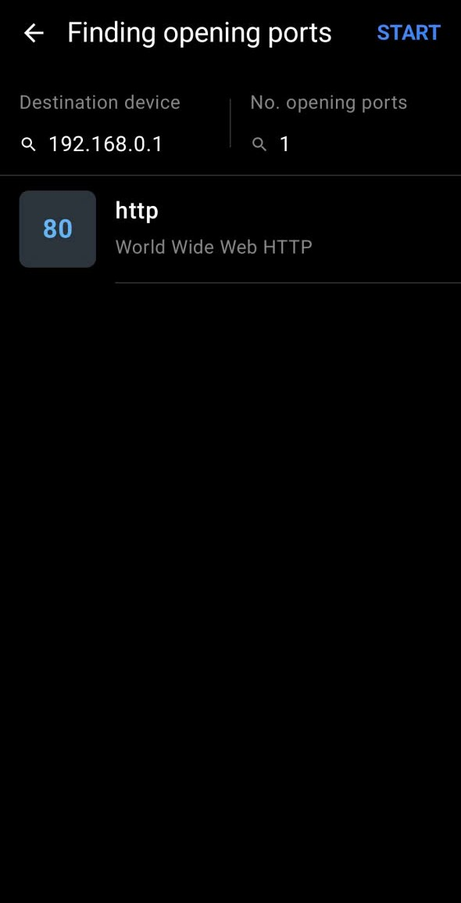
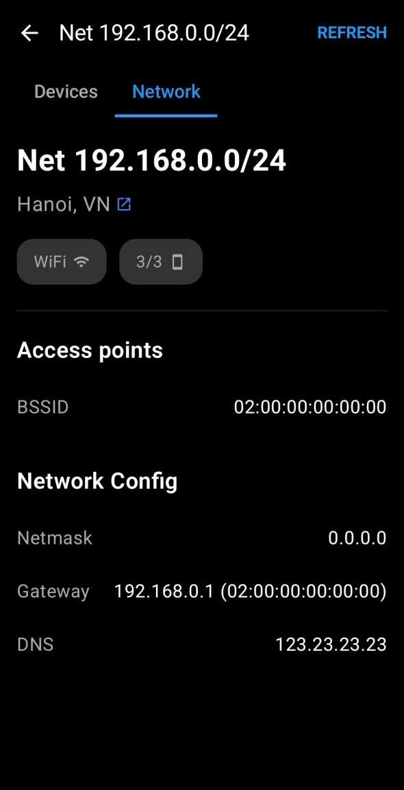
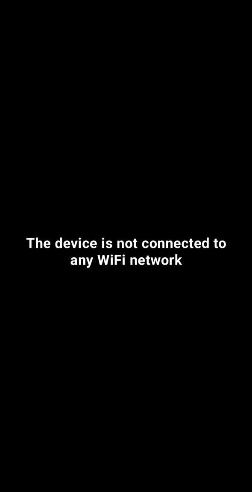

# LAN Scanner

A lightweight, privacy-focused, and high-performance network discovery and port scanning utility for Android. This application allows users to discover active devices in their local area network (LAN), inspect open ports mapped against official IANA services, and retrieve network diagnostics without requiring invasive device permissions.

## Features

- **Active Device Discovery:** Scan the local network to identify all active hosts, retrieving both their IPv4 addresses and hostnames efficiently.
- **Asynchronous Port Scanning:** Inspects specific target hosts for open TCP ports, instantly mapping results against the standard IANA port dictionary to identify running services.
- **LAN Information Diagnostics:** Retrieves key network specifications (Subnet, Gateway, Netmask, DNS) alongside a public IP-based geolocation mechanism to determine network city/country position without relying on GPS.
- **Robust Error Handling:** Features an explicit state-checking system. If the device disconnects from the network, the app immediately transitions to an intuitive "No network found" state on the entry screen instead of crashing.

## Main Screens

The application architecture is structured around three core user interfaces built with modern declarative UI paradigms:
1. **Device List Screen:** Displays a real-time list of all discovered online devices within the current subnet.
   
2. **Port Details Screen:** Appears when a device is selected, listing all detected open ports along with their corresponding protocol descriptions.
   
3. **Network Info Screen:** Provides a comprehensive breakdown of the current connection properties and geographical network location.
   
4. **Exception Screen:** Show error message when device disconnects from the network.
   

## Non-Functional Requirements

- **Backward Compatibility:** Fully supports and runs smoothly on devices running **Android 6.0 (API Level 23) and above**.
- **Permission-Friendly Architecture:** Zero dependency on privacy-invasive runtime permissions. The application strictly relies on standard network state flags (`ACCESS_NETWORK_STATE`, `ACCESS_WIFI_STATE`) and does **not** request `ACCESS_FINE_LOCATION` or `ACCESS_COARSE_LOCATION`.
- **UI Stability & Real-time Synchronization:** Utilizes immutable state updates and unique diffing keys (such as device IP addresses). This guarantees that the list of devices remains perfectly stable, free from duplicates, and resistant to UI-shuffling or stuttering during background network synchronization.

## Requirements

- Android Studio Jellyfish or newer
- Android SDK 23+ (Android 6.0 Marshmallow)
- Kotlin 1.9+

## Release Notes
To see what has changed in recent versions, please read the [CHANGELOG](CHANGELOG.md).